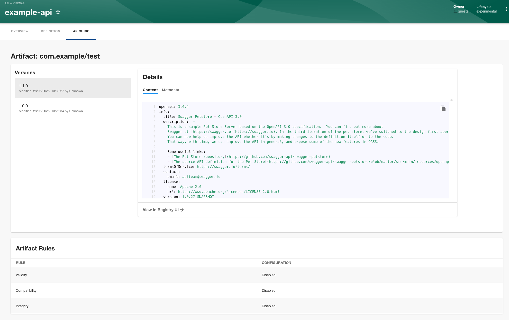

# Apicurio Registry Plugin for Backstage

This is a Backstage plugin for Apicurio Registry, which allows you to manage and view your API schemas and artifacts.



## Installation

To install the Apicurio Registry plugin, follow these steps:

1. Install the plugin using Yarn:

   ```bash
   cd packages/app 
   yarn add @andamp/backage-apicurio-registry-plugin
   ```

2. Add the proxy config to your `app-config.yaml`:

   ```yaml
   proxy:
     '/apicurio-registry':
       target: https://<APICURIO_API_URL>/apis/registry/v3
       credentials: forward
   ```

3. Add the UI URL to your `app-config.yaml`:

   ```yaml
   apicurio:
     ui:
       baseUrl: https://<APICURIO_UI_URL>
   ```

4. Add the Apicurio Registry Page Widget to your API entities page:

   ```tsx
   import { ApicurioRegistryPage } from '@andamp/backage-apicurio-registry-plugin';
   
   export const entityPage = (
     <EntityLayout>
       <EntityLayout.Route path="/apicurio-registry" title="Apicurio Registry">
         <ApicurioRegistryPage />
       </EntityLayout.Route>
     </EntityLayout>
   );
   ```
   
5. Add the annotations to your API entities:

   ```yaml
   apiVersion: backstage.io/v1alpha1
   kind: API
   metadata:
     name: my-api
     annotations:
       apicur.io/registry.artifactId: <ARTIFACT_ID>
       apicur.io/registry.groupId: <GROUP_ID>
   spec:
     definition:
       $text: https://<APICURIO_API_URL>/apis/registry/v3/groups/<GROUP_ID>/artifacts/<ARTIFACT_ID>/versions/branch=latest/content
   ```

   You can also track other branches by changing the `branch=latest` part of the URL to the desired branch name.
